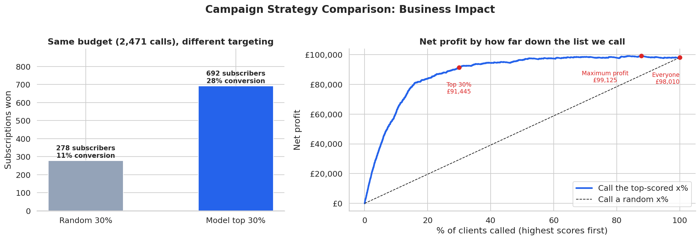
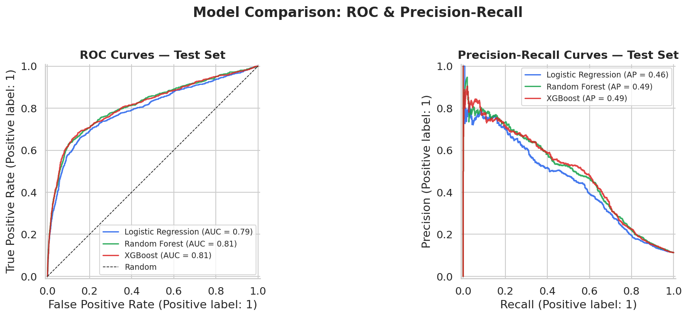
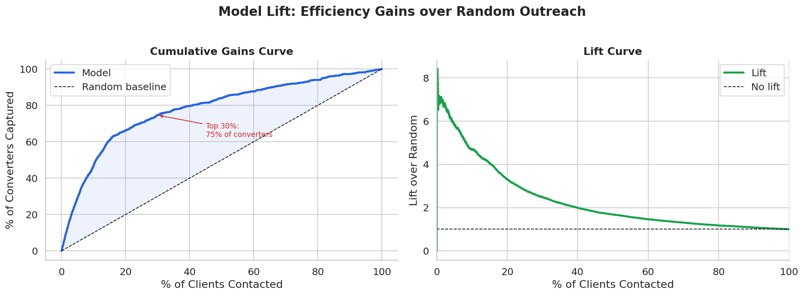

# Marketing & Financial Analytics: Predicting Term Deposit Subscriptions

[](https://www.python.org/)
[](https://scikit-learn.org/)
[](https://xgboost.readthedocs.io/)
[](https://shap.readthedocs.io/)
[](LICENSE)

**Predicting which bank clients will subscribe to a term deposit, and quantifying what that prediction is worth.** Compares three classifiers, interprets them with SHAP, stress-tests them on a time-based split, and translates scores into campaign strategy and profit.



## Key results

- **Random Forest and XGBoost reach a test ROC-AUC of 0.81** using only information available before a call (logistic regression: 0.79).
- **At the same budget, the model wins 2.5 times as many subscriptions.** Calling the top-scored 30% of clients brings in 692 subscriptions versus 278 from calling a random 30%, at £17.85 per subscription instead of £44.39.
- **The top 30% keeps 93% of the profit with 70% fewer calls.** Because a subscription is worth far more than a call, calling everyone is still profitable (£98k), but the model reaches almost the same profit (£91k) with a fraction of the call-centre capacity. Profit peaks when calling the top 88%.
- **Honest out-of-time performance.** Trained on earlier campaigns and tested on the most recent 20% of calls, ROC-AUC falls to 0.73, so the model would need regular retraining in production.

## Problem

A Portuguese bank runs phone campaigns to sell term deposits. Two questions drive this project:

1. **Can we predict which clients will subscribe**, using client profile and campaign data?
2. **What is the financial value** of using those predictions to prioritise calls, compared with calling at random?

## Dataset

The [UCI Bank Marketing dataset](https://archive.ics.uci.edu/dataset/222/bank+marketing) (`bank-additional-full`): **41,188 client contacts** from May 2008 to November 2010, with 20 inputs across three domains.

| Domain | Examples |
|---|---|
| Client profile | Age, job, education, marital status, loans |
| Campaign activity | Number of contacts, contact method, month, previous campaign outcome |
| Economic context | Euribor 3-month rate, employment variation rate, consumer confidence |

**Target:** did the client subscribe? **11.3%** did, handled with `class_weight` and `scale_pos_weight`.

> **Leakage note:** call `duration` is excluded from all models. It is only known after a call ends, so it cannot be used to decide who to call, and including it would inflate performance unrealistically.

## Methods

### Feature engineering

| Feature | Description |
|---|---|
| `prior_success` | Previous campaign ended in a subscription |
| `contacted_heavily` | Contacted more than 3 times this campaign |
| `was_previously_contacted` | Contacted in an earlier campaign |
| `econ_score` | Composite of employment variation, consumer confidence and Euribor |
| `has_loan` | Housing or personal loan active |
| `peak_month` | Last contact in March, September, October or December |
| `is_senior`, `is_young` | Age 60+ or under 30 |
| `degree_educated` | University degree holder |

### Models

| Model | Interpretability | CV ROC-AUC | Test ROC-AUC | Test avg precision |
|---|---|---|---|---|
| Logistic Regression | High | 0.784 | 0.795 | 0.455 |
| **Random Forest** | Medium | 0.799 | **0.814** | 0.489 |
| XGBoost | Lower | 0.795 | 0.814 | 0.493 |

5-fold stratified cross-validation on the training set, then a single evaluation on a 20% held-out test set. As a robustness check, a time-based split (train on the earliest 80% of contacts, test on the latest 20%) gives ROC-AUC 0.73.



### Interpretation

SHAP values for the XGBoost model show that:

- **Economic context dominates.** Low employment, low Euribor rates and low consumer confidence push predictions up. In this data these conditions coincide with 2009 and 2010, so they largely capture *when* a call was made.
- **Mobile contact** outperforms landline.
- **More contacts in the current campaign** sharply lower the prediction.
- **Recent previous contact** and **previous campaign success** raise it. Past subscribers re-subscribed 65% of the time.

> **Prediction is not causation.** SHAP explains what the model relies on, not what would happen if we intervened. Clients called many times may simply be harder to convince, so capping calls would not necessarily raise conversion. Estimating effects like that needs a causal design, such as a randomised test or methods like TMLE. See my [email campaign causal impact](https://github.com/Asantewaah/email-campaign-causal-impact) project for that side of the problem.

## Business value

Assumptions (set at the top of `src/04_business_value.py`): **£150 revenue per subscription** (1.5% margin on a £10,000 deposit) and **£5 per call**. Results on the 8,238-client test set:

| Strategy | Clients called | Subscriptions | Conversion | Share of all subscribers | Net profit | Cost per subscription |
|---|---|---|---|---|---|---|
| Call everyone | 8,238 | 928 | 11.3% | 100% | £98,010 | £44.39 |
| Random 30% | 2,471 | 278 | 11.3% | 30% | £29,398 | £44.39 |
| **Model top 30%** | 2,471 | **692** | **28.0%** | **75%** | **£91,445** | **£17.85** |
| Model top 15% | 1,235 | 564 | 45.7% | 61% | £78,425 | £10.95 |



## Limitations

- **Time effects.** The economic indicators largely encode the time period, so part of the random-split accuracy reflects *when* calls were made. The time-based check is the more realistic estimate for a future campaign.
- **Illustrative economics.** The revenue and cost figures are assumptions, and the best calling depth depends on them.
- **Associations only.** None of the findings are causal effects.

## Project structure

```
marketing-financial-analytics/
├── bank_marketing_analysis.ipynb   full annotated walkthrough with outputs, start here
├── src/
│   ├── 01_eda.py                   exploratory data analysis
│   ├── 02_features.py              cleaning, feature engineering, train/test split
│   ├── 03_model.py                 model training, evaluation, SHAP, time-based check
│   └── 04_business_value.py        strategy comparison, profit and lift analysis
├── data/bank_marketing.csv         UCI Bank Marketing data
├── figures/                        all 11 output charts
├── outputs/                        metrics and strategy tables
└── requirements.txt
```

## How to run

```bash
git clone https://github.com/Asantewaah/marketing-financial-analytics.git
cd marketing-financial-analytics
pip install -r requirements.txt

python src/01_eda.py
python src/02_features.py
python src/03_model.py          # a few minutes
python src/04_business_value.py
```

Or open `bank_marketing_analysis.ipynb`, which runs all four scripts in order.

## Data source and citation

S. Moro, P. Cortez and P. Rita. *A Data-Driven Approach to Predict the Success of Bank Telemarketing.* Decision Support Systems, 62:22–31, 2014. Dataset from the UCI Machine Learning Repository, licensed under CC BY 4.0.

---

**Author:** [Juliet Asantewaa Sarpong](https://asantewaah.github.io), data scientist and PhD researcher in Statistics at the University of Edinburgh, specialising in causal inference.

[](https://asantewaah.github.io)
[](https://www.linkedin.com/in/juliet-asantewaa-sarpong)
[](https://github.com/Asantewaah)
